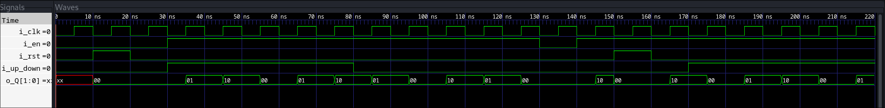

# Mod N up down counter
## __Introduction__
 The mod-N conditional up-down counter is a digital counter that counts up or down based on a
 control signal and wraps around after reaching a maximum count of N-1.
 It is commonly used in applications where counting in a specific range with directional control is
 required
 
## Features
- Counts from 0 to N-1
- Up and down counting capability based on control signal
- Synchronous operation with a clock signal
- Conditional counting based on an enable signal
- Reset functionality to initialize the counter
## Inputs
 - Clock (i_clk) : The primary clock signal for synchronizing the counter.
 - Reset (i_rst) : An asynchronous signal that resets the counter to 0 when asserted.
 - Enable (i_en) : A signal that enables counting when asserted. When deasserted, the counter
 holds its value.
 - Up/Down (i_up_down) : A control signal that determines the counting direction. When
 asserted (high), the counter counts up; when deasserted (low), the counter counts down.
## Outputs
 - Count (o_Q): The current value of the counter, ranging from 0 to N-1
 ## Operation
 - Counting Up: When `up_down` is high and `en` is asserted, the counter increments its value
 on each rising edge of the clock.
 - Counting Down: When `up_down` is low and `en` is asserted, the counter decrements its
 value on each rising edge of the clock.
 - Wrap Around : When counting up and the counter reaches N-1, it wraps around to 0 on the next clock edge.
- When counting down and the counter reaches 0, it wraps around to N-1 on the next clock edge.
 - Hold : When `en` is deasserted, the counter holds its current value regardless of the clock
 edges.
 - Reset : When `rst` is asserted, the counter is asynchronously reset to 0, overriding all other
 signals.

## Digital circuit 
 

## RTL using FSM 
```verilog
module mod_N_counter #(parameter WIDTH = 2 ,parameter N = 3)(
  input i_clk,
  input i_rst,
  input i_en,
  input i_up_down,
  output reg [WIDTH-1:0] o_Q
  );
parameter [2:0] RST = 3'b000,
                INCREMENT = 3'b011,
                DECREMENT = 3'b010,
                IDLE = 3'b111,
                WRAP = 3'b110;

reg [2:0]state,next;
// sequential asysnchronous reset 
always @ (posedge i_clk or posedge i_rst) begin
  state <= (i_rst) ? RST : next;
end
// combinational always state assginment 
always @ (state or next or i_en or i_up_down) begin
  case (state)
    //RST : next = ((!i_en) || i_rst)? ((! i_en) ? IDLE : RST) : { i_rst , i_en , i_up_down};
    RST : next = i_en ? (i_up_down ? INCREMENT : DECREMENT) : IDLE;
    
    INCREMENT : begin  
      next = i_en ? (i_up_down ? INCREMENT : DECREMENT) : IDLE;
      next = (o_Q == N-1) ? WRAP : next;
    end 
    
    DECREMENT : begin  
      next = i_en ? (i_up_down ? INCREMENT : DECREMENT) : IDLE;
      next = (o_Q == 0) ? WRAP : next;
    end 
    
    WRAP : begin  
      next = i_en ? (i_up_down ? INCREMENT : DECREMENT) : IDLE;
      next = (o_Q == N-1) ? WRAP : next;
    end 
    
    IDLE : next = i_en ? (i_up_down ? INCREMENT : DECREMENT) : IDLE;
       default: next = RST;
  endcase
end
// sequential output assignment 
always @ (posedge i_clk) begin
  case (state)
    RST : o_Q <=0;

    INCREMENT : o_Q <= o_Q + 1;

    DECREMENT : o_Q <= o_Q - 1;

    WRAP : o_Q <= (o_Q == N-1) ? 0 : 1;

    IDLE : o_Q <= o_Q ;

    default : o_Q <=0;
  endcase
end
endmodule
```
## RTL
``` verilog
module mod_N_counter #(parameter WIDTH = 2 ,parameter N = 3)(
  input i_clk,
  input i_rst,
  input i_en,
  input i_up_down,
  output reg [WIDTH-1:0] o_Q
);

always @ (posedge i_clk or posedge i_rst) begin
  if (i_rst) // Active high reset
    o_Q <= 0;
  else if (i_en) begin
    if (i_up_down)
      o_Q <= (o_Q == N-1) ? 0 : (o_Q + 1); // Up counter logic
    else
      o_Q <= (o_Q == 0) ? (N-1) : (o_Q - 1); // Down counter logic
  end
end

endmodule

```
## Testbench

```verilog
`timescale 1ns / 1ps
`include "mod_N_counter_1.sv"

module tb_mod_N_counter;

parameter WIDTH = 2;
parameter N = 3;

// Inputs
reg i_clk;
reg i_rst;
reg i_en;
reg i_up_down;

// Outputs
wire [WIDTH-1:0] o_Q;

mod_N_counter #(WIDTH, N) uut (
    .i_clk(i_clk),
    .i_rst(i_rst),
    .i_en(i_en),
    .i_up_down(i_up_down),
    .o_Q(o_Q)
);

// Clock generation
initial begin
    i_clk = 0;
    forever #5 i_clk = ~i_clk; // 10ns period
end

initial begin
    // Initialize inputs
    i_rst = 0;
    i_en = 0;
    i_up_down = 0;

    // Apply reset
    #10 i_rst = 1;
    #10 i_rst = 0;

    // Enable counter and set to increment mode
    #10 i_en = 1;
    i_up_down = 1;

    #50;

    // Set to decrement mode
    i_up_down = 0;

    #50;

    // Disable counter
    i_en = 0;

    // Let it idle for a few cycles
    #10;
    
    i_en = 1;


    // Apply reset 
    #10 i_rst = 1;
    #10 i_rst = 0;

    // Enable counter and set to increment mode
    #10 i_en = 1;
    i_up_down = 1;

    #50;

    // Finish simulation
    $finish;
end
initial begin
  $dumpfile("waves.vcd");
  $dumpvars();
end
endmodule
```
## Constraints 
```tcl 
set sdc_version 2.1

create_clock -period 5 -name clk [get_ports clk] -waveform 0 , 5;
set_clock_latency 3 clk

set_clock_uncertainty 0.5 clk

#####setting IO paths ##########
#setting up max and min input delay
set_input_delay -max 3 -clock [get_clocks clk][get_portsIN_*];
set_input_delay -min 3 -clock [get_clocks clk][get_portsIN_*];
#setting up max and min input transistion 
set_input_transition -max 1.5 [get_portsIN_*];
set_input_transition -min 7.5 [get_portsIN_*];


#setting up max and min input delay
set_output_delay -max 3 -clock [get_clocks clk][get_ports o_Q];
set_output_delay -min 0.5 -clock [get_clocks clk][get_ports o_Q];

```
## Simulation screenshot

